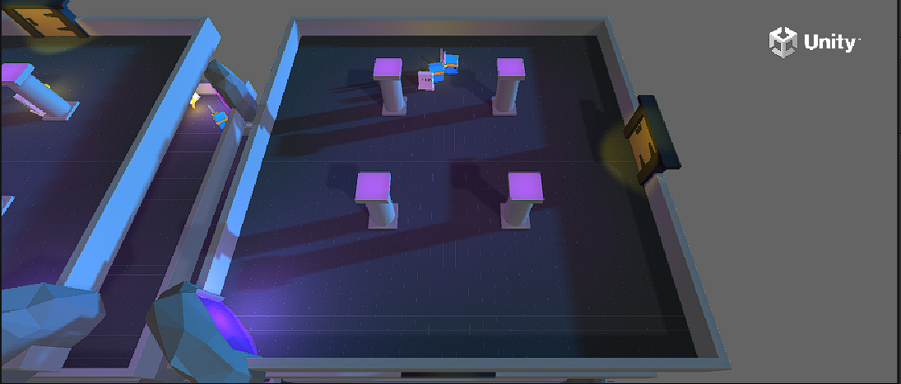
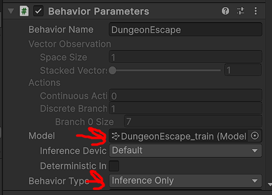
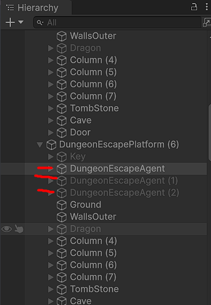

# DungeonEscapeTF



# Entrenamiento de agentes con ML-Agents en Unity

Este proyecto describe los pasos iniciales para configurar y entrenar agentes de aprendizaje por refuerzo utilizando el paquete [ML-Agents](https://github.com/Unity-Technologies/ml-agents) de Unity.

## Requerimientos Previos

- **Conda** (como gestor de paquetes y entornos de Python)
- **Unity** (para crear y exportar entornos ejecutables)
- **Git** (para clonar repositorios)
- **Git LFS** (para manejar archivos binarios grandes)

## Paso 0: Crear y Activar el Entorno Conda

Primero, creamos un entorno virtual con Python 3.10.12 usando conda:

```bash
conda create --name rl python=3.10.12
conda activate rl
```

## Paso 1: Instalar ML-Agents

Clonamos el repositorio oficial de ML-Agents:

```bash
git clone https://github.com/Unity-Technologies/ml-agents
```

Este proceso descarga aproximadamente 2.63 GB. Una vez finalizado, ingresamos al directorio del repositorio y procedemos con la instalación:

```bash
cd ml-agents
pip install -e ./ml-agents-envs
pip install -e ./ml-agents
```

### Nota para Usuarios de Mac con Apple Silicon

En algunos casos, la instalación puede fallar (por ejemplo, al compilar ONNX). Si ocurre esto, se recomienda instalar grpcio antes:

```bash
conda install grpcio
```

Si los problemas persisten, puedes revisar este [issue](https://github.com/Unity-Technologies/ml-agents/issues/5831) en el repositorio oficial de ML-Agents para más información.

## Paso 2: Instalar Git LFS

Es necesario instalar Git LFS para manejar los grandes archivos binarios (ejecutables, modelos, etc.):
- Página oficial de Git LFS: https://git-lfs.com/

Sigue las instrucciones para tu sistema operativo.

## Paso 3: Agregar el Ejecutable del Entorno de Entrenamiento

En lugar de usar el ejemplo SoccerTwos, utilizaremos el entorno Dungeon Escape. Para ello:

1. Descarga el entorno Dungeon Escape siguiendo las instrucciones en la documentación oficial y ejecuta Unity y genera un ejecutable siguiendo esta guía: [Crear un nuevo entorno de aprendizaje](https://github.com/Unity-Technologies/ml-agents/blob/develop/docs/Learning-Environment-Create-New.md).

Una vez que tengas el ejecutable listo, crea una carpeta dentro de ml-agents llamada `training-envs-executables` y coloca allí el archivo resultante.

*(El nombre y extensión del ejecutable pueden variar según tu sistema operativo.)*

## Paso 4: Entrenamiento del Agente

Ya con el entorno listo y el conda activado, ejecutamos el siguiente comando para iniciar el proceso de entrenamiento (ejemplo con la configuración de SoccerTwos, que puedes adaptar a DungeonEscape):

```bash
mlagents-learn ./config/poca/DungeonEscape.yaml --env=./training-envs-executables/DungeonEscape/UnityEnvironment.exe --run-id="DungeonEscape" --no-graphics
```

**Nota:**
- En este ejemplo se muestra el archivo SoccerTwos.yaml y el ejecutable SoccerTwos.exe, pero deberás adaptar el comando al entorno Dungeon Escape y a su correspondiente archivo de configuración.
- El entrenamiento puede tardar entre 7-8 horas, dependiendo de la complejidad del entorno y los recursos disponibles.

## Paso 5: Ejecutar el Entorno Localmente con el Modelo Entrenado

Una vez finalizado el entrenamiento:

1. Abre nuevamente el proyecto en Unity
2. Carga el modelo entrenado en cada agente
3. Cambia el modo de los agentes a Inference Only
4. Ejecuta la escena pulsando play para observar el comportamiento de los agentes entrenados





*(Consulta las imágenes anexadas y la documentación oficial si tienes dudas sobre estos pasos.)*

Con estos pasos, habrás configurado el entorno, instalado las herramientas necesarias, entrenado un agente y finalmente, corrido el entorno localmente con el modelo resultante.
